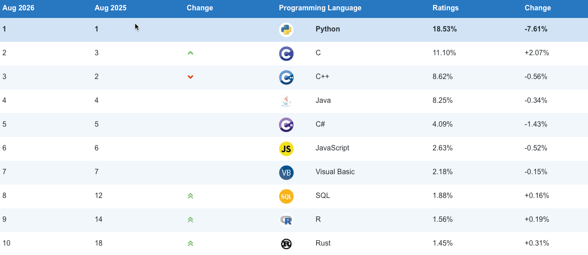
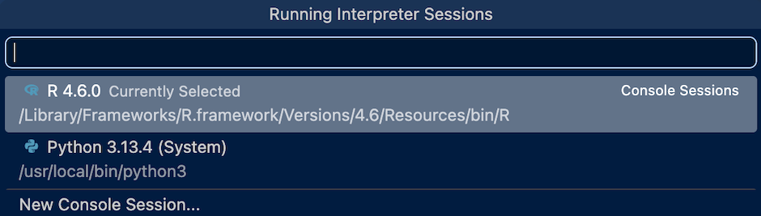
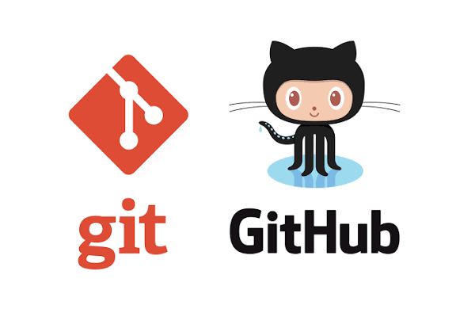
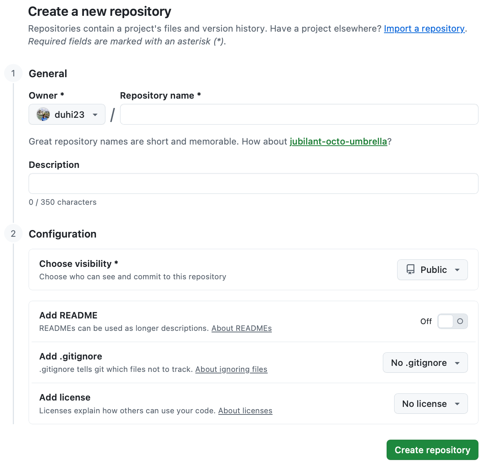
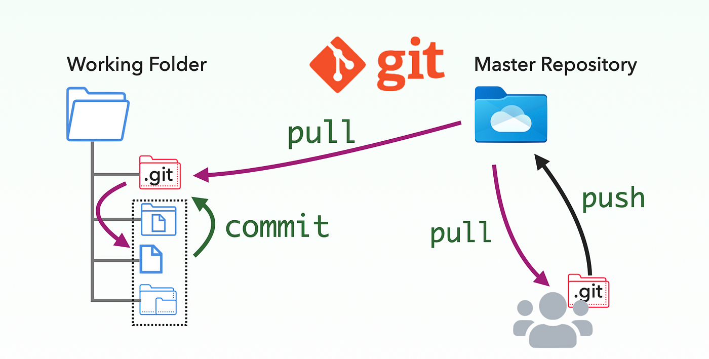
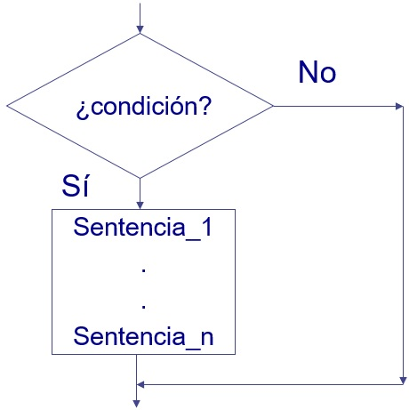

```{r}
#| label: setup
#| include: false

library(reticulate)
if (!py_module_available("pandas")) {
  py_install(c("pandas", "numpy", "matplotlib", "openpyxl"))
}
```

::: {.column-margin}
::: {.logos-auspiciantes}


:::
:::

## Motivación {.unnumbered}

::: {.motivacion}
**¿Por qué nos importa esto?**

R y Python son los lenguajes más usados en análisis de datos, estadística y ciencia de datos, pero provienen de comunidades distintas: R se creó para programación estadística y Python para programación general. En la práctica profesional es común encontrar equipos donde algunos analistas programan en R y otros en Python, y ambos deben poder leer y entender el trabajo del otro. Este tema proporciona las bases de programación: *variables, estructuras de datos, control de flujo, funciones y manejo de archivos* en **ambos lenguajes a la vez**, para que el estudiante pueda moverse entre ellos con soltura y elegir la herramienta correcta según el problema, no según la costumbre.
:::

{width=85%}

## Objetivos de aprendizaje

Al finalizar este tema, el estudiante será capaz de:

- Instalar y configurar R, Python, Positron y Git/GitHub en su computador.
- Declarar variables y usar las estructuras de datos básicas (vectores/listas
  y dataframes) en R y en Python.
- Escribir sentencias condicionales y repetitivas en ambos lenguajes.
- Crear y usar funciones propias.
- Leer y escribir archivos de distintas fuentes (texto plano, CSV, Excel,
  JSON).

## Instalación y configuración del entorno

::: {.teoria}
Antes de programar se necesita instalar tres cosas: los **lenguajes** (R y
Python), el **IDE** (Positron) y el **sistema de control de versiones**
(Git/GitHub). Esta sección es una guía de referencia; síguela una sola vez
al preparar tu computador.
:::

### Instalación de R

1. Descarga R desde CRAN: <https://cran.r-project.org/> (elige tu sistema
   operativo: Windows, macOS o Linux).
2. Instala con las opciones por defecto.
3. Verifica la instalación abriendo una terminal y ejecutando:
   ```bash
   R --version
   ```

:::{.callout-morado .column-margin}
El CRAN (Comprehensive R Archive Network) es la red oficial y global de servidores espejo que centraliza el ecosistema del lenguaje R, almacenando su instalador base, la documentación técnica y más de 20,000 paquetes de funciones adicionales. Su propósito principal es garantizar un acceso rápido, seguro y de alta calidad a las herramientas de análisis de datos, permitiendo a los usuarios instalar complementos revisados y verificados de forma automática.
:::

### Instalación de Python

1. Descarga Python desde <https://www.python.org/downloads/> (versión 3.10
   o superior), o instala una distribución como **Miniconda**
   (<https://docs.conda.io/en/latest/miniconda.html>) si prefieres manejar
   entornos virtuales con `conda`.
2. Durante la instalación en Windows, marca la opción **"Add Python to
   PATH"**.
3. Verifica la instalación:
   ```bash
   python --version
   pip --version
   ```

### Instalación y manejo de paquetes/librerías

::: {.teoria}
Sin librerías, programar en R o Python es como intentar construir una mesa yendo primero al bosque a talar el árbol, para luego fundir metal con el fin de fabricar tus propios clavos y herramientas de corte. Al tener que desarrollar cada funcionalidad desde cero, el proceso se vuelve lento, tedioso y propenso a errores estructurales. En cambio, utilizar librerías equivale a entrar a un taller moderno y totalmente equipado, donde abres una caja de herramientas y tomas un martillo, una lijadora eléctrica o pegamento industrial listos para usar. Al saltarte la fabricación de herramientas y maquinaria, puedes concentrarte exclusivamente en el diseño y el ensamblaje, lo que te permite crear un producto resistente, eficiente y de calidad profesional en una fracción del tiempo.
:::

:::{.callout-morado .column-margin}
La instalación estándar de R incluye por defecto un total de 14 paquetes. Son el núcleo indispensable del lenguaje. Se instalan y se cargan automáticamente en la memoria cada vez que abres R, por lo que sus funciones están listas para usarse sin comandos previos.
:::

:::{.callout-morado .column-margin}
Python trae una colección masiva de módulos y paquetes preinstalados conocida oficialmente como la Biblioteca Estándar de Python, lo que significa que el lenguaje viene listo para resolver problemas complejos desde el primer segundo.
:::

::: {.panel-tabset}
## R

```r
# Instalar un paquete desde CRAN
install.packages("tidyverse")

# Cargar el paquete en la sesión actual
library(tidyverse)

# (Opcional) reticulate, necesario para mezclar R y Python en Quarto
install.packages("reticulate")
```

Para fijar versiones reproducibles de paquetes por proyecto se recomienda
`renv`:
```r
install.packages("renv")
renv::init()   # crea un entorno aislado para el proyecto
```

## Python

```bash
# Crear un entorno virtual aislado para el proyecto
python -m venv .venv

# Activarlo
source .venv/bin/activate      # Linux / macOS
.venv\Scripts\activate         # Windows

# Instalar librerías
pip install pandas numpy matplotlib openpyxl

# Guardar las dependencias del proyecto
pip freeze > requirements.txt

# Instalar desde requirements.txt en otro computador
pip install -r requirements.txt
```
:::

### Positron

Positron es un entorno de desarrollo integrado (IDE) de última generación que supera a alternativas tradicionales como **RStudio** al combinar la potencia del ecosistema de **VS Code** con una arquitectura específicamente optimizada para la ciencia de datos. A diferencia de otros editores genéricos, ofrece una interfaz nativa con paneles dedicados para la visualización de datos, variables y gráficos que se ejecutan en procesos independientes, lo que impide que el entorno se bloquee al procesar grandes volúmenes de información. Además, su gran ventaja competitiva radica en su **capacidad multilingüe real**, permitiendo alternar de forma simultánea, fluida y sin configuraciones complejas entre proyectos de R y Python dentro de un mismo espacio de trabajo moderno y altamente extensible.

{.column-margin width=150px}

#### Configuración de Positron

Positron reconoce automáticamente los intérpretes instalados, pero conviene
verificarlo:

1. Abre Positron y crea/abre la carpeta del proyecto (`File → Open Folder`).
2. En la barra superior derecha, usa el **selector de intérprete** para
   elegir la versión de **R** que quieres usar en la sesión de consola.
   {width=80%}
3. Repite el proceso para elegir el intérprete/entorno de **Python**
   (idealmente el `.venv` creado en el paso anterior).
4. Instala la extensión **Quarto** (usualmente viene preinstalada) para
   poder renderizar archivos `.qmd` con el botón **Render**.
5. Ambos lenguajes pueden convivir en el mismo `.qmd` gracias al paquete de
   R `reticulate`, que se carga en el chunk `setup` del documento.

  ```bash
  #| label: setup
  #| include: false

  library(reticulate)
  if (!py_module_available("pandas")) {
    py_install(c("pandas", "numpy", "matplotlib", "openpyxl"))
  }
  ```

### Control de versiones con GitHub

En la programación, la genialidad individual **se potencia** cuando se comparte de forma ordenada el código. GitHub no es solo un almacén de archivos; es el lienzo donde el código cobra vida, se transforma y se escala sin perder el control. Al adoptarlo dejas atrás el **caos de las versiones infinitas y de los archivos duplicados**.

{.column-margin width=150px}

::: {.teoria}
GitHub es una plataforma de desarrollo colaborativo basada en la nube que utiliza el **sistema de control de versiones Git** para almacenar, gestionar y rastrear cambios en el código fuente. Funciona como un repositorio centralizado donde programadores y científicos de datos pueden guardar sus proyectos de forma segura, permitiendo revisar el historial completo de modificaciones y revertir errores en cualquier momento sin perder el trabajo previo. Su mayor valor radica en facilitar el trabajo en equipo mediante herramientas como "ramas" (**branches**) para experimentar de forma aislada y "pull requests" para revisar código antes de integrarlo al proyecto principal. Además, al integrarse nativamente con entornos como Positron y VS Code, se ha convertido en el **estándar global** tanto para el desarrollo de software comercial como para la colaboración en proyectos de código abierto y de ciencia de datos.
:::

1. Instala Git: <https://git-scm.com/downloads>.
2. Regístrate en Github y crea una cuenta gratuita: <https://github.com/signup>.
3. Configura tu identidad (una sola vez por computador) con el usuario y correo que registraste en GitHub, para ello, en el terminal ejecuta:
   ```bash
   git config --global user.name "Tu Usuario"
   git config --global user.email "tu_correo@ejemplo.com"
   ```
4. Crea un repositorio en Github (botón **New repository**).
    {width=80%}
5. Vincula tu carpeta local con el repositorio remoto:
   ```bash
   git init
   git remote add origin https://github.com/<usuario>/<repositorio>.git
   git add .
   git commit -m "Primer commit"
   git branch -M main
   git push -u origin main
   ```

6. En Positron, el panel **Source Control** (ícono de rama en la barra
   lateral) permite hacer `stage`, `commit` y `push`/`pull` sin usar la
   terminal, si lo prefieres.
   

Flujo básico que usarás a lo largo de todo el curso si optas por usar GitHub para el control de versiones:
{.column-margin width=250px}

  ```bash
  git pull           # Traer los últimos cambios
  # ... Editas tus archivos ...
  git add archivo.qmd   # Agregas nuevos archivos o cambios
  git commit -m "Descripción breve del cambio"   # Comentas
  git push           # Envías los cambios al repositorio
  ```

:::{.callout-morado .column-margin}
💡 **Tip:** Si prefieres enviar el 100% de los archivos de tu versión local:

git push -u origin main --force
:::

[Guía Rápida de Git](./docs/git-cheat-sheet-education.pdf)

## Estructuras de datos

En la ciencia de datos y la actuaría, la gestión eficiente de la información depende directamente de la **elección adecuada** de las estructuras de datos. Tanto Python como R ofrecen un **amplio catálogo de objetos nativos y extendidos** como: *vectores, listas, DataFrames y arreglos* diseñados para manipular desde colecciones unidimensionales simples hasta tablas multidimensionales complejas, permitiendo **optimizar el uso de memoria y la velocidad de cómputo** según la naturaleza de los datos.

Comprender la sintaxis, mutabilidad e intencionalidad de estos objetos en ambos lenguajes es el paso fundamental para construir flujos de trabajo estructurados, analizables y altamente escalables.

### Variables y tipos de datos básicos
::: {.teoria}
Una **variable** es un nombre que apunta a un *valor guardado en memoria*. Los
tipos básicos son equivalentes conceptualmente en ambos lenguajes:

| Tipo            | R                    | Python           |
|-----------------|----------------------|-------------------|
| Numérico entero | `integer` (`5L`)     | `int` (`5`)       |
| Numérico decimal| `numeric` (`5.2`)    | `float` (`5.2`)   |
| Texto           | `character` (`"a"`)  | `str` (`"a"`)     |
| Lógico          | `logical` (`TRUE`)   | `bool` (`True`)   |
:::

:::{.callout-morado .column-margin}
💡 **Tip:** En R usa `<-` para asignar variables, mientras que en Python se usa `=`.
:::

::: {.panel-tabset}
## R

```{r}
#| label: variables-r

edad <- 20L
altura <- 1.68
nombre <- "María"
es_estudiante <- TRUE

class(edad); class(altura); class(nombre); class(es_estudiante)
```

## Python

```{python}
#| label: variables-py

edad = 20
altura = 1.68
nombre = "María"
es_estudiante = True

print(type(edad), type(altura), type(nombre), type(es_estudiante))
```
:::


### Vectores (R) y su equivalente en Python

::: {.teoria}
En **R**, el vector (`c()`) es la estructura fundamental: una colección
**homogénea** (todos los elementos del mismo tipo) y es la base de casi todo
en el lenguaje. **Python no tiene un tipo "vector" nativo**; su estructura
básica es la **lista**, que es heterogénea y ordenada. Cuando en Python se
necesita un vector homogéneo con operaciones matemáticas vectorizadas (como
en R), se usa un **array de NumPy**.
:::

::: {.panel-tabset}
## R

```{r}
#| label: vectores-r

notas <- c(8, 7.5, 9, 6.8, 10)

notas          # imprime el vector completo
notas[1]       # primer elemento (R indexa desde 1)
notas[2:4]     # subconjunto por rango
notas[-2]      # subconjunto excluyendo el segundo elemento
notas * 2      # operación vectorizada: se aplica a cada elemento
notas - c(0.5, 1)    # reciclaje de elementos: el vector más corto se repite
mean(notas)    # operación con todos los elementos: min, max, sum, sqrt, etc.
length(notas)  # número de elementos
```

## Python

```{python}
#| label: vectores-py

# Lista nativa (heterogénea, sin operaciones vectorizadas automáticas)
notas = [8, 7.5, 9, 6.8, 10]

print(notas)
print(notas[0])        # Python indexa desde 0
print(notas[1:4])      # subconjunto por rango (el índice final no es inclusivo)

# Para comportamiento "vectorial" como en R, se usa NumPy
import numpy as np
notas = np.array(notas)

print(np.delete(notas, 1))       # subconjunto excluyendo el segundo elemento
print(notas * 2)    # operación vectorizada
# Reciclaje de elementos (en Python se simula repitiendo el vector más corto)
print(notas.mean())    # Operaciones globales (media, min, max, sum, sqrt).
print(len(notas))      # número de elementos
```
:::

### Listas

::: {.teoria}
En **R**, `list()` permite guardar elementos de **distinto tipo y tamaño**
(incluso otras listas). En **Python**, la lista (`[]`) ya cumple ese rol de
forma nativa, sin necesidad de una función especial.
:::

::: {.panel-tabset}
## R

```{r}
#| label: listas-r

estudiante <- list(
  nombre = "Carlos",
  edad = 22L,
  notas = c(8, 7, 9, 10)
)

estudiante$nombre     # acceso por nombre
estudiante[["notas"]] # acceso por nombre (forma alternativa)
estudiante$notas[2]   # acceso anidado
mean(estudiante[["notas"]])  # promedio de las notas
```

## Python

```{python}
#| label: listas-py

# En Python, un diccionario es más análogo a la "lista con nombres" de R
estudiante = {
    "nombre": "Carlos",
    "edad": 22,
    "notas": [8, 7, 9, 10]
}

print(estudiante["nombre"])   # acceso por clave
print(estudiante["notas"][1])  # acceso anidado
print(np.mean(estudiante["notas"]))  # promedio de las notas
```
:::

### Dataframes

::: {.teoria}
El Data Frame es la estructura **bidimensional** fundamental para el análisis de datos en ambos lenguajes, caracterizada por organizar la información en **filas y columnas** donde cada columna puede albergar un tipo de dato distinto (*numérico, texto, factor o lógico*). Mientras que en R esta estructura forma parte del núcleo nativo del lenguaje (`data.frame`), en Python se implementa a través de la librería especializada Pandas (`pd.DataFrame`); no obstante, en ambos entornos comparten el **mismo principio conceptual**: actuar como una tabla al estilo de una base de datos o hoja de cálculo, facilitando la manipulación, filtrado, agregación y transformación de conjuntos de datos complejos de manera altamente eficiente.
:::

::: {.panel-tabset}
## R

```{r}
#| label: dataframe-r

datos <- data.frame(
  nombre = c("Ana", "Luis", "Marta", "Diego"),
  edad = c(21, 23, 22, 28),
  promedio = c(8.5, 7.2, 9.1, 10)
)

datos
str(datos)          # estructura de cada columna
datos$promedio      # acceso a una columna
datos[datos$edad > 21, ]   # filtrado de filas
datos[datos$edad <= 25 & datos$promedio > 8.2, ]   # filtrado de filas
```

## Python

```{python}
#| label: dataframe-py

import pandas as pd

datos = pd.DataFrame({
    "nombre": ["Ana", "Luis", "Marta", "Diego"],
    "edad": [21, 23, 22, 28],
    "promedio": [8.5, 7.2, 9.1, 10]
})

datos
datos.info()               # estructura de cada columna
datos["promedio"]          # acceso a una columna
datos[datos["edad"] > 21]  # filtrado de filas
datos[(datos["edad"] <= 25) & (datos["promedio"] > 8.2)]  # filtrado de filas
```
:::

### Ejercicios resueltos

::: {.ejercicio-resuelto}

**Ejemplo 1:** Crea un vector/lista con las temperaturas (°C) registradas
en una semana en la ciudad de Quito: 18, 20, 19, 22, 21, 17, 16. Se pide:

  a. Calcular la temperatura promedio, y
  b. Cuántos días en la semana las temperaturas superaron los 19°C ?.

**Solución razonada:** Primero se almacenan los datos en una estructura
homogénea correspondiente de cada lenguaje, luego se aplica una función de
agregación para el promedio y una condición lógica para contar los días
que cumplen el criterio.

::: {.panel-tabset}
## R

```{r}
#| label: resuelto1-r

temperaturas <- c(18, 20, 19, 22, 21, 17, 16)

promedio <- mean(temperaturas)
dias_calurosos <- sum(temperaturas > 19)

cat("Promedio:", promedio, "\n")
cat("Días con más de 19°C:", dias_calurosos, "\n")
```

## Python

```{python}
#| label: resuelto1-py

import numpy as np

temperaturas = np.array([18, 20, 19, 22, 21, 17, 16])

promedio = temperaturas.mean()
dias_calurosos = (temperaturas > 19).sum()

print("Promedio:", promedio)
print("Días con más de 19°C:", dias_calurosos)
```
:::

**Nota:** El operador de comparación (`> 19`)
aplicado a toda la estructura genera un vector/array lógico, y `sum()`
cuenta los `TRUE`/`True`, aprovechando que en ambos lenguajes `TRUE`/`True`
se trata como `1` al sumarse.
:::

::: {.ejercicio-resuelto}

**Ejemplo 2:** Construya un dataframe con 4 productos, su precio y la
cantidad vendida. Se pide:

  a. Agregar una columna "ingreso" = precio × cantidad
  b. Mostrar solo los productos con ingreso mayor a 100.
  c. Calcular el total de productos disponibles con un precio inferior a 1 usd.

::: {.panel-tabset}
## R

```{r}
#| label: resuelto2-r

productos <- data.frame(
  producto = c("Cuaderno", "Lápiz", "Mochila", "Borrador", "Goma", "Regla"),
  precio = c(2.5, 0.5, 38, 0.6, 1.4, 0.3),
  cantidad = c(52, 100, 7, 60, 70, 25)
)
# Data Frame creado
productos
# Nueva columna "ingreso" calculada a partir de las columnas existentes
productos$ingreso <- productos$precio * productos$cantidad
# Data Frame actualizado con la nueva columna
productos
# Filtro de productos con ingreso mayor a 100
productos[productos$ingreso > 100, ]
# Productos con precio inferior a 1 usd
sum(productos[productos$precio < 1,]$cantidad)
```

## Python

```{python}
#| label: resuelto2-py

import pandas as pd

productos = pd.DataFrame({
    "producto": ["Cuaderno", "Lápiz", "Mochila", "Borrador", "Goma", "Regla"],
    "precio": [2.5, 0.5, 38, 0.6, 1.4, 0.3],
    "cantidad": [52, 100, 7, 60, 70, 25]
})
# Data Frame creado
productos
# Nueva columna "ingreso" calculada a partir de las columnas existentes
productos["ingreso"] = productos["precio"] * productos["cantidad"]
# Data Frame actualizado con la nueva columna
productos
# Filtro de productos con ingreso mayor a 100
productos[productos["ingreso"] > 100]
# Productos con precio inferior a 1 usd
print(productos[productos["precio"] < 1]["cantidad"].sum())
```
:::

**Nota:** Crear una columna nueva a partir de columnas existentes es una 
operación vectorizada en ambos lenguajes: la multiplicación se aplica fila 
por fila sin necesidad de un bucle explícito.
:::

### Ejercicios propuestos

::: {.ejercicio-propuesto}

**Ejercicio 1:** Crea un vector/array con las edades de 8 personas de tu elección. 

Calcular la edad máxima, mínima y la desviación estándar.

::: {.panel-tabset}
## R
```{webr}
#| exercise: ex_1
# Completa la solución en R
edades <- c(____)
# Edad máxima
maxima <- ____
# Edad mínima
minima <- ____
# Desviación estándar
desviacion <- ____
# Impresión de resultados
cat("Máx: ", maxima, "Mín: ", minima, "Std: ", desviacion)
```

## Python
```{pyodide-python}
#| exercise: ex_1
import numpy as np
# Completa la solución en Python
edades = np.array([____])
# Edad máxima
maxima = ____
# Edad mínima
minima = ____
# Desviación estándar
desviacion = ____
# Impresión de resultados
print(f"Máx: {maxima}, Mín: {minima}, Std: {desviacion:.2f}")
```
:::
:::


::: {.ejercicio-propuesto}

**Ejercicio 2:** Complete el dataframe de las notas de 5 estudiantes, sus tres notas parciales
y calcule una columna "promedio_final". Se pide:

  a. Filtrar a los estudiantes que aprueban (promedio_final >= 7)
  b. Filtrar a los estudiantes cuya máxima nota parcial es inferior a 5 (reprobados).


::: {.panel-tabset}
## R
```{webr}
#| exercise: ex_2
# Completa la solución en R
estudiantes <- data.frame(
      nombres = c("Luis", "Jaime", "David", "Ana", "María"),
      nota1 = c(8,____),
      nota2 = c(____),
      nota3 = c(____))
# Cálculo del promedio final
estudiantes$promedio_final <- (____)/3
# Filtrar a los estudiantes aprobados
estudiantes[____]
# Filtrar a los estudiantes reprobados
estudiantes[____]
```

## Python
```{pyodide-python}
#| exercise: ex_2
import numpy as np
# Completa la solución en Python
estudiantes = pd.DataFrame({
    "nombres": ["Luis", "Jaime", "David", "Ana", "María"],
    "nota1": [8, ____],
    "nota2": [____],
    "nota3": [____]})
# Cálculo del promedio final
estudiantes["promedio_final"] = ____(axis=1)
# Filtrar a los estudiantes aprobados
estudiantes[____]
# Filtrar a los estudiantes reprobados
estudiantes[____]
```
:::
:::

## Sentencias condicionales

::: {.teoria}
Las sentencias condicionales son estructuras fundamentales de control de flujo que permiten a un programa **evaluar expresiones lógicas y ejecutar bloques de código específicos** según el resultado sea verdadero o falso (`TRUE/FALSE` en R o `True/False` en Python). Mientras que Python destaca por su sintaxis limpia y minimalista basada en la sangría obligatoria (`if, elif, else`), R utiliza una estructura tradicional delimitada por llaves (`if, else if, else`) e integra potentes alternativas vectorizadas como `ifelse()` o `dplyr::case_when()`. Dominar estas herramientas en ambos lenguajes es esencial para implementar lógica de negocios, transformar variables en data frames y automatizar la toma de decisiones dentro de pipelines de análisis de datos o algoritmos de machine learning.

La lógica es idéntica en ambos lenguajes; únicamente cambia la sintaxis.
:::

{.column-margin width=250px}

::: {.panel-tabset}
## R

```{r}
#| label: condicionales-r

nota <- 8.5

if (nota >= 9) {
  print("Excelente")
} else if (nota >= 7) {
  print("Aprobado")
} else {
  print("Reprobado")
}
```

## Python

```{python}
#| label: condicionales-py

nota = 8.5

if nota >= 9:
    print("Excelente")
elif nota >= 7:
    print("Aprobado")
else:
    print("Reprobado")
```
:::

:::{.callout-morado .column-margin}
**Nota**: R usa llaves `{ }` para delimitar los bloques; Python usa
**indentación** (habitualmente 4 espacios) — no son opcionales, definen
dónde empieza y termina cada bloque.
:::

### Operadores Lógicos

::: {.teoria}
Los operadores lógicos permiten combinar o invertir evaluadores booleanos. En Python, la sintaxis es **expresiva y basada en palabras clave en inglés** (`and, or, not`), las cuales realizan evaluación de operadores escalares y vectorizados. Por su parte, R **distingue estrictamente** entre operadores escalares (`&&, ||`), diseñados para evaluar condiciones de un solo elemento dentro de estructuras como `if()`, y operadores vectorizados (`&, |, !`), que efectúan comparaciones elemento por elemento a lo largo de vectores o columnas de data frames.
:::

::: {.ejercicio-resuelto}

**Ejemplo 3:** A continuación se presenta un conjunto de datos correspondiente al historial crediticio de 10 solicitantes de crédito en una institución financiera ecuatoriana. Se pide:

  a. Agregar la columna "evaluación" que determine si la solicitud es "Aprobado" (si los ingresos son mayores o iguales a 1800 y el puntaje de crédito es mayor a 650) o "Rechazado" en caso contrario.
  b. Agregar la columna "segmento_riesgo" utilizando las siguientes reglas:
    - *Bajo*: si el puntaje es mayor a 750.
    - *Medio*: si el puntaje está entre 600 y 750 (inclusive).
    - *Alto*: si el puntaje es menor a 600.
  c. Filtrar el data frame para mostrar únicamente los clientes cuyo segmento de riesgo sea "Alto" o hayan sido "Rechazado".

::: {.panel-tabset}
## R

```{r}
#| label: resuelto3-r
creditos <- data.frame(
  cliente = paste0("C", 1:10),
  edad = c(25, 42, 31, 58, 22, 37, 49, 29, 61, 34),
  ingresos = c(1200, 2500, 1900, 3100, 950, 2100, 1750, 1800, 4000, 1500),
  puntaje = c(580, 720, 680, 790, 610, 760, 590, 640, 810, 550)
)
# Solicitudes de crédito
creditos
# Creación de la columna "evaluación"
creditos$evaluacion <- ifelse(creditos$ingresos >= 1800 & creditos$puntaje > 650, "Aprobado", "Rechazado")
creditos
# Creación de la columna "segmento_riesgo"
creditos$segmento <- ifelse(creditos$puntaje > 750, "Bajo",
                                   ifelse(creditos$puntaje >= 600, "Medio", "Alto"))
creditos
# Filtrado de clientes con segmento de riesgo "Alto" o ha sido "Rechazado"
creditos[creditos$segmento == "Alto" | creditos$evaluacion == "Rechazado", ]
```

## Python

```{python}
#| label: resuelto3-py
import numpy as np
import pandas as pd

creditos = pd.DataFrame({
    "cliente": [f"C{i}" for i in range(1, 11)],
    "edad": [25, 42, 31, 58, 22, 37, 49, 29, 61, 34],
    "ingresos": [1200, 2500, 1900, 3100, 950, 2100, 1750, 1800, 4000, 1500],
    "puntaje": [580, 720, 680, 790, 610, 760, 590, 640, 810, 550],
})
# Solicitudes de crédito
print(creditos)
# Creación de la columna "evaluacion" mediante np.where
creditos["evaluacion"] = np.where(
    (creditos["ingresos"] >= 1800) & (creditos["puntaje"] > 650),
    "Aprobado", "Rechazado")
print(creditos)
# Creación de la columna "segmento" mediante np.select
condiciones = [creditos["puntaje"] > 750, creditos["puntaje"] >= 600]
opciones = ["Bajo", "Medio"]
creditos["segmento"] = np.select(condiciones, opciones, default="Alto")
print(creditos)
# Filtrado de clientes con segmento de riesgo "Alto" o evaluación "Rechazado"
resultado = creditos[
    (creditos["segmento"] == "Alto") | (creditos["evaluacion"] == "Rechazado")
]
print(resultado)
```
:::

**Nota:** La función `ifelse()` permite evaluar condiciones lógicas elemento por elemento a lo largo de un vector o columna de un data frame, retornando un nuevo vector con la misma longitud que la entrada.
:::


### Ejercicios propuestos

::: {.ejercicio-propuesto}
#### Ejercicio propuesto 3

Dado un número entero, determina si es positivo, negativo o cero, y además
si es par o impar (deberás combinar dos condicionales).

::: {.panel-tabset}
## R
```{r}
#| label: propuesto3-r
#| eval: false

# Completa aquí tu solución en R
```

## Python
```{python}
#| label: propuesto3-py
#| eval: false

# Completa aquí tu solución en Python
```
:::
:::

## Sentencias repetitivas

::: {.teoria}
Los bucles permiten repetir un bloque de código. Los dos más usados son
**`for`** (cuando se conoce de antemano la secuencia a recorrer) y
**`while`** (cuando se repite mientras se cumpla una condición).
:::

::: {.panel-tabset}
## R

```{r}
#| label: repetitivas-r

# for: recorre un vector
for (i in 1:5) {
  cat("Iteración", i, "\n")
}

# while: se repite mientras la condición sea verdadera
contador <- 1
while (contador <= 5) {
  cat("Contador:", contador, "\n")
  contador <- contador + 1
}
```

## Python

```{python}
#| label: repetitivas-py

# for: recorre un rango o cualquier iterable
for i in range(1, 6):
    print("Iteración", i)

# while: se repite mientras la condición sea verdadera
contador = 1
while contador <= 5:
    print("Contador:", contador)
    contador += 1
```
:::

### Ejercicios resueltos

::: {.ejercicio-resuelto}
#### Ejercicio resuelto 4

**Enunciado:** Recorre un vector/lista de calificaciones y cuenta cuántas
están aprobadas (≥ 7), usando un bucle `for` (sin usar funciones de
agregación directas).

::: {.panel-tabset}
## R

```{r}
#| label: resuelto5-r

notas <- c(8, 5, 9, 6, 7, 4, 10)
aprobados <- 0

for (n in notas) {
  if (n >= 7) {
    aprobados <- aprobados + 1
  }
}

cat("Aprobados:", aprobados, "\n")
```

## Python

```{python}
#| label: resuelto5-py

notas = [8, 5, 9, 6, 7, 4, 10]
aprobados = 0

for n in notas:
    if n >= 7:
        aprobados += 1

print("Aprobados:", aprobados)
```
:::

**Interpretación del resultado:** El patrón "acumulador + bucle +
condicional" es una de las combinaciones más comunes en programación: se
inicializa una variable contadora antes del bucle y se actualiza dentro de
él según una condición.
:::

### Ejercicios propuestos

::: {.ejercicio-propuesto}
#### Ejercicio propuesto 4

Usando un bucle `while`, encuentra el primer múltiplo de 7 mayor a 200.

::: {.panel-tabset}
## R
```{r}
#| label: propuesto4-r
#| eval: false

# Completa aquí tu solución en R
```

## Python
```{python}
#| label: propuesto4-py
#| eval: false

# Completa aquí tu solución en Python
```
:::
:::

## Creación de funciones

::: {.teoria}
Una función agrupa un bloque de código reutilizable que recibe
**argumentos** (entradas) y produce un **valor de retorno** (salida). Ambos
lenguajes admiten valores por defecto para los argumentos.
:::

::: {.panel-tabset}
## R

```{r}
#| label: funciones-r

calcular_imc <- function(peso, altura) {
  imc <- peso / (altura^2)
  return(round(imc, 2))
}

calcular_imc(70, 1.75)

# Argumento con valor por defecto
saludar <- function(nombre, saludo = "Hola") {
  cat(saludo, ",", nombre, "!\n")
}

saludar("Ana")
saludar("Luis", saludo = "Buenos días")
```

## Python

```{python}
#| label: funciones-py

def calcular_imc(peso, altura):
    imc = peso / (altura ** 2)
    return round(imc, 2)

print(calcular_imc(70, 1.75))

# Argumento con valor por defecto
def saludar(nombre, saludo="Hola"):
    print(f"{saludo}, {nombre}!")

saludar("Ana")
saludar("Luis", saludo="Buenos días")
```
:::

### Ejercicios resueltos

::: {.ejercicio-resuelto}
#### Ejercicio resuelto 5

**Enunciado:** Crea una función que reciba un vector/lista de números y
devuelva un resumen con el mínimo, máximo y promedio.

::: {.panel-tabset}
## R

```{r}
#| label: resuelto6-r

resumen_numerico <- function(x) {
  list(
    minimo = min(x),
    maximo = max(x),
    promedio = mean(x)
  )
}

resumen_numerico(c(4, 8, 15, 16, 23, 42))
```

## Python

```{python}
#| label: resuelto6-py

def resumen_numerico(x):
    return {
        "minimo": min(x),
        "maximo": max(x),
        "promedio": sum(x) / len(x)
    }

resumen_numerico([4, 8, 15, 16, 23, 42])
```
:::

**Interpretación del resultado:** Devolver una lista/diccionario en lugar de
varios valores sueltos permite empaquetar resultados relacionados y
acceder a cada uno por nombre, lo cual hace el código más legible.
:::

### Ejercicios propuestos

::: {.ejercicio-propuesto}
#### Ejercicio propuesto 5

Crea una función `es_primo(n)` que reciba un número entero y devuelva
`TRUE`/`True` si es primo, `FALSE`/`False` en caso contrario. Pruébala con
al menos 5 números distintos.

::: {.panel-tabset}
## R
```{r}
#| label: propuesto5-r
#| eval: false

# Completa aquí tu solución en R
```

## Python
```{python}
#| label: propuesto5-py
#| eval: false

# Completa aquí tu solución en Python
```
:::
:::

## Lectura y escritura de archivos

::: {.teoria}
Los datos rara vez se escriben a mano dentro del código: normalmente se
leen desde archivos externos (texto, CSV, Excel, JSON) y, tras procesarlos,
se guardan de vuelta. A continuación se muestran las funciones equivalentes
en R y Python para las fuentes más comunes.

| Formato      | R                                   | Python (pandas / json / base)   |
|--------------|--------------------------------------|----------------------------------|
| Texto plano  | `readLines()` / `writeLines()`      | `open()` + `.read()`/`.write()` |
| CSV          | `read.csv()` / `write.csv()`        | `pd.read_csv()` / `.to_csv()`   |
| Excel        | `readxl::read_excel()` / `openxlsx::write.xlsx()` | `pd.read_excel()` / `.to_excel()` |
| JSON         | `jsonlite::fromJSON()` / `toJSON()` | `json.load()` / `json.dump()`, o `pd.read_json()` |
:::

::: {.panel-tabset}
## R

```{r}
#| label: archivos-r
#| eval: false

# --- Texto plano ---
lineas <- readLines("datos/notas.txt")
writeLines(c("línea 1", "línea 2"), "datos/salida.txt")

# --- CSV ---
datos <- read.csv("datos/estudiantes.csv")
write.csv(datos, "datos/estudiantes_editado.csv", row.names = FALSE)

# --- Excel (requiere el paquete readxl / openxlsx) ---
library(readxl)
library(openxlsx)
datos_excel <- read_excel("datos/notas.xlsx", sheet = 1)
write.xlsx(datos_excel, "datos/notas_editado.xlsx")

# --- JSON (requiere el paquete jsonlite) ---
library(jsonlite)
datos_json <- fromJSON("datos/config.json")
write_json(datos_json, "datos/config_editado.json", pretty = TRUE)
```

## Python

```{python}
#| label: archivos-py
#| eval: false

import pandas as pd
import json

# --- Texto plano ---
with open("datos/notas.txt", "r") as f:
    lineas = f.readlines()

with open("datos/salida.txt", "w") as f:
    f.write("línea 1\nlínea 2\n")

# --- CSV ---
datos = pd.read_csv("datos/estudiantes.csv")
datos.to_csv("datos/estudiantes_editado.csv", index=False)

# --- Excel (requiere la librería openpyxl instalada) ---
datos_excel = pd.read_excel("datos/notas.xlsx", sheet_name=0)
datos_excel.to_excel("datos/notas_editado.xlsx", index=False)

# --- JSON ---
with open("datos/config.json", "r") as f:
    datos_json = json.load(f)

with open("datos/config_editado.json", "w") as f:
    json.dump(datos_json, f, indent=2, ensure_ascii=False)
```
:::

::: {.callout-objetivo}
Buena práctica: usa siempre **rutas relativas** dentro del proyecto (por
ejemplo `"datos/archivo.csv"`) en lugar de rutas absolutas de tu
computador, para que el `.qmd` funcione igual en cualquier máquina y al
subirlo a GitHub.
:::

### Ejercicios resueltos

::: {.ejercicio-resuelto}
#### Ejercicio resuelto 6

**Enunciado:** Crea un dataframe con datos de 3 estudiantes, guárdalo como
CSV, y vuelve a leerlo para confirmar que se guardó correctamente.

::: {.panel-tabset}
## R

```{r}
#| label: resuelto7-r

estudiantes <- data.frame(
  nombre = c("Ana", "Luis", "Marta"),
  promedio = c(8.5, 7.2, 9.1)
)

write.csv(estudiantes, "estudiantes_temp.csv", row.names = FALSE)
verificacion <- read.csv("estudiantes_temp.csv")
verificacion
```

## Python

```{python}
#| label: resuelto7-py

import pandas as pd

estudiantes = pd.DataFrame({
    "nombre": ["Ana", "Luis", "Marta"],
    "promedio": [8.5, 7.2, 9.1]
})

estudiantes.to_csv("estudiantes_temp.csv", index=False)
verificacion = pd.read_csv("estudiantes_temp.csv")
verificacion
```
:::

**Interpretación del resultado:** `row.names = FALSE` (R) e `index=False`
(Python) evitan que se guarde una columna adicional con el número de fila,
que normalmente no aporta información útil al archivo exportado.
:::

### Ejercicios propuestos

::: {.ejercicio-propuesto}
#### Ejercicio propuesto 6

Crea un archivo de texto plano con 5 líneas (una frase por línea), léelo de
vuelta, y cuenta cuántas líneas contienen la palabra "datos".

::: {.panel-tabset}
## R
```{r}
#| label: propuesto6-r
#| eval: false

# Completa aquí tu solución en R
```

## Python
```{python}
#| label: propuesto6-py
#| eval: false

# Completa aquí tu solución en Python
```
:::
:::

::: {.ejercicio-propuesto}
#### Ejercicio propuesto 7

Descarga o crea un archivo `.csv` con al menos 10 filas de datos de tu
elección, léelo, agrega una columna calculada, y guarda el resultado en un
nuevo archivo `.xlsx`.

::: {.panel-tabset}
## R
```{r}
#| label: propuesto8-r
#| eval: false

# Completa aquí tu solución en R
```

## Python
```{python}
#| label: propuesto8-py
#| eval: false

# Completa aquí tu solución en Python
```
:::
:::

## Resumen del tema

- R y Python instalados en Positron pueden convivir en un mismo documento
  Quarto gracias a `reticulate`.
- Git/GitHub permiten versionar el material y trabajar de forma colaborativa
  y reproducible.
- La estructura homogénea básica es el **vector** en R y el **array de
  NumPy** en Python; la estructura heterogénea es la **lista** en ambos
  lenguajes (con matices).
- El **dataframe** es la estructura tabular común a ambos lenguajes
  (nativo en R, vía `pandas` en Python).
- Condicionales y bucles comparten la misma lógica; cambia la sintaxis
  (llaves vs. indentación).
- Las funciones permiten reutilizar código y son la base para construir
  programas más grandes y organizados.
- Ambos lenguajes ofrecen funciones equivalentes para leer/escribir texto,
  CSV, Excel y JSON.

## Referencias

- Wickham, H. & Grolemund, G. *R for Data Science*. <https://r4ds.hadley.nz/>
- VanderPlas, J. *Python Data Science Handbook*. <https://jakevdp.github.io/PythonDataScienceHandbook/>
- Documentación oficial de R: <https://cran.r-project.org/manuals.html>
- Documentación oficial de Python: <https://docs.python.org/3/>
- Documentación de Quarto: <https://quarto.org/docs/guide/>
- Documentación de Git: <https://git-scm.com/doc>
